# EDR Attack & Defense

## Overview

This lab is dedicated to simulating a real cyber attack and endpoint detection and response. I will be using virtual machines to simulate the threat & victim machines. The attack machine will utilize 'Sliver' as a C2 framework to attack a Windows endpoint machine, which will be running 'LimaCharlie' as an EDR solution. The goal is to simulate real-world attack scenarios, observe detection capabilities, and enhance defenses using **LimaCharlie D&R rules**.

## Environment Setup

- **EDR Solution:** LimaCharlie
- **Operating System:** [Specify OS, e.g., Windows 10, Ubuntu]
- **Attack Tools Used:** [Mention tools, e.g., Mimikatz, Rubeus, etc.]
- **Defense Mechanism:** LimaCharlie D&R rules

## Attack Simulation

### ✅ Credential Access Techniques Tested
- Dumping credentials using Mimikatz
- LSASS memory dump analysis
- Extracting NTLM hashes

## Defense Implementation

### ✅ Detection & Response (D&R) Rules
- **Process monitoring:** Detect suspicious LSASS access
- **Memory analysis:** Identify unauthorized memory dumps
- **Behavior-based detection:** Flag known credential dumping patterns

## Results

- **Successful detection of credential dumping attempts** 🔍
- **D&R rules triggered alerts and mitigated threats** ✅
- **SIEM logs captured attack activity** 📊

## Setup

#### The first step to the lab is setting up both machines. The attack machine will run on Ubuntu Server, and the endpoint will be running Windows 11. In order for this lab to work smoothly Microsoft Defender should be turned off (along with other settings). I am also going to be installing Sliver on the Ubuntu machine as my primary attack tool, and setting up LimaCharlie on the Windows machine as an EDR solution. LimaCharlie will have a sensor linked to the windows machine, and will be importing sysmon logs.

#### Windows 11 machine :
  

#### Ubuntu machine :

## Attack and the Defense

#### The first step is to generate our payload on Sliver, and implant the malware into the Windows host machine. Then we can create a command and control session after the malware is executed on the endpoint.

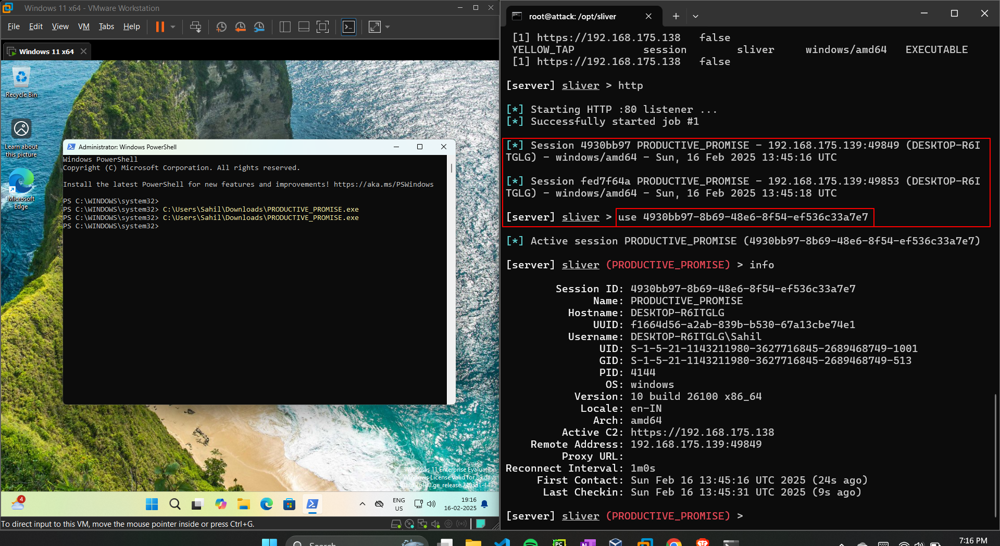

#### Now that we have a live session between the two machines, the attack machine can begin peeking around, checking priveleges, getting host information, and checking what type of security the host has.

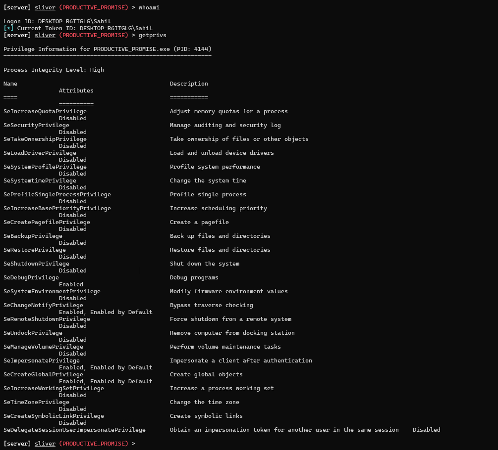
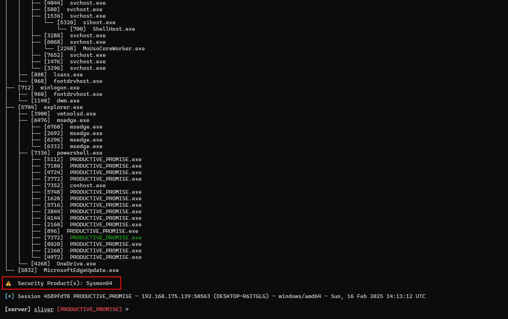

#### On the host machine we can look inside our LimaCharlie SIEM and see telemetry from the attacker. We can identify the payload thats running and see the IP its connected to.

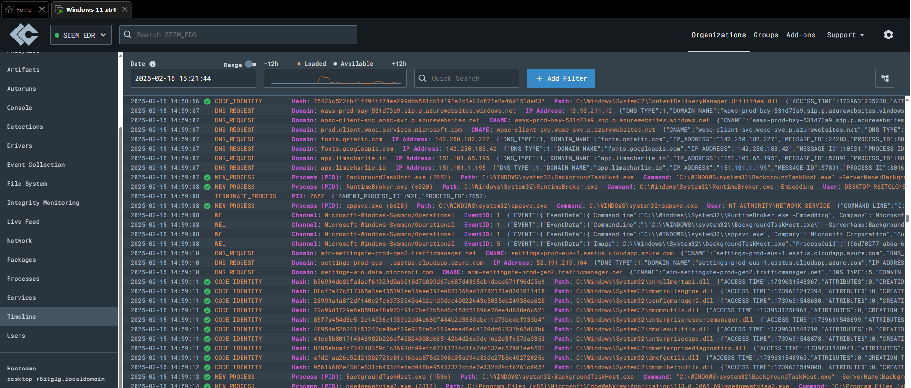
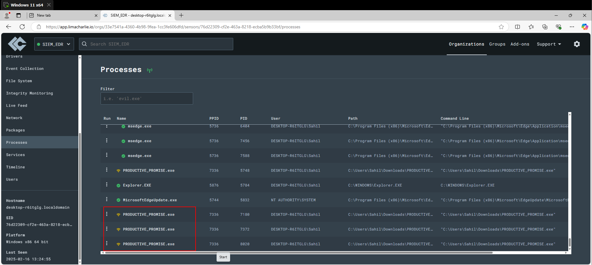

#### We can also use LimaCharlie to scan the hash of the payload through VirusTotal; however, it will be clean since we just created the payload ourselves.

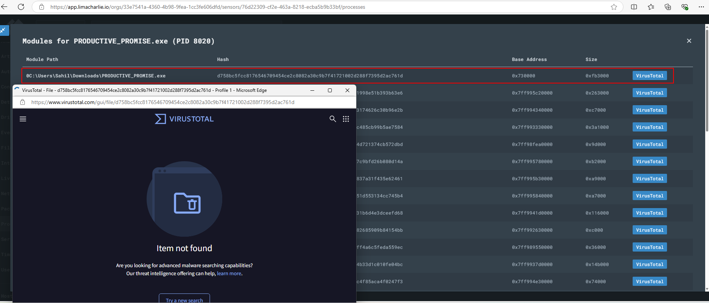

#### I wrote a custom rule under D&R rules, that will detect and block the attacks coming from the Sliver server. On the Ubuntu machine we can simulate parts of a ransomware attack, by attempting to delete the volume shadow copies. In LimaCharlie we can view the telemetry and then write a rule that will block the attack entirely. After we create the rule in our SIEM, the Ubuntu machine will have no luck trying the same attack again.

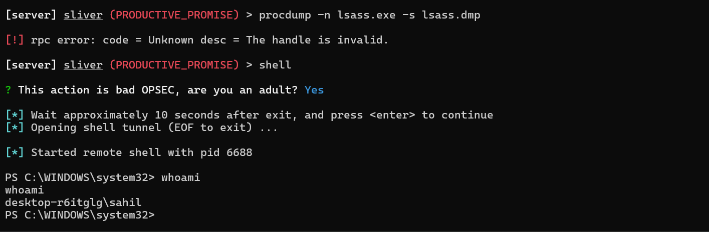

#### In the detections tab, the "Whoami utility Execution" is detected.
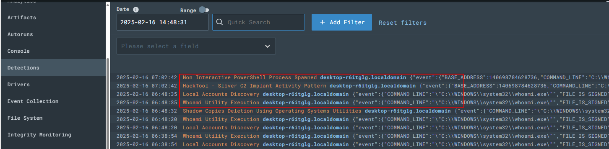
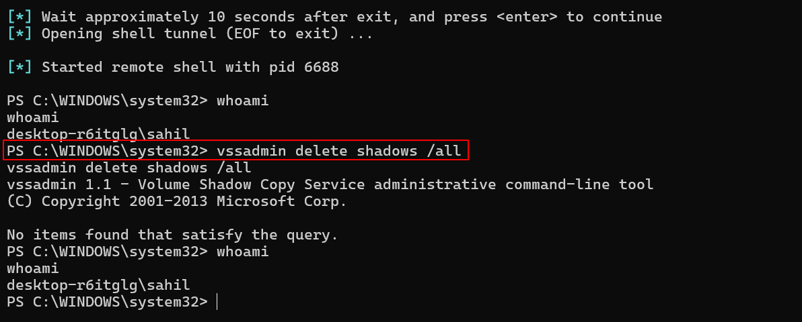

#### "vssadmin delete shadows" command is detected
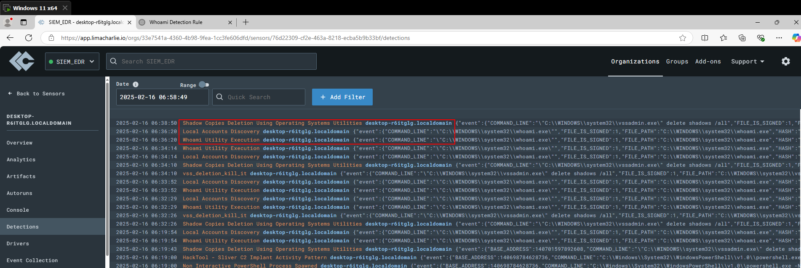
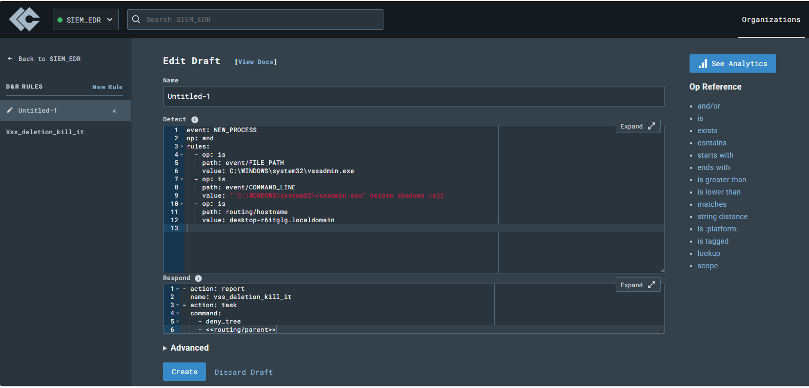
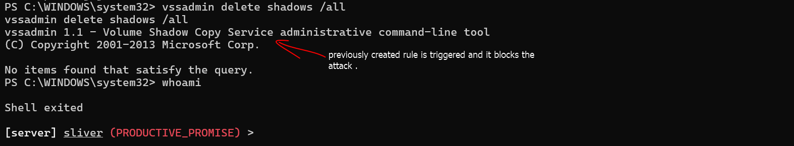

---

> *"Detection is the first step. Response makes the difference."* 🔐
